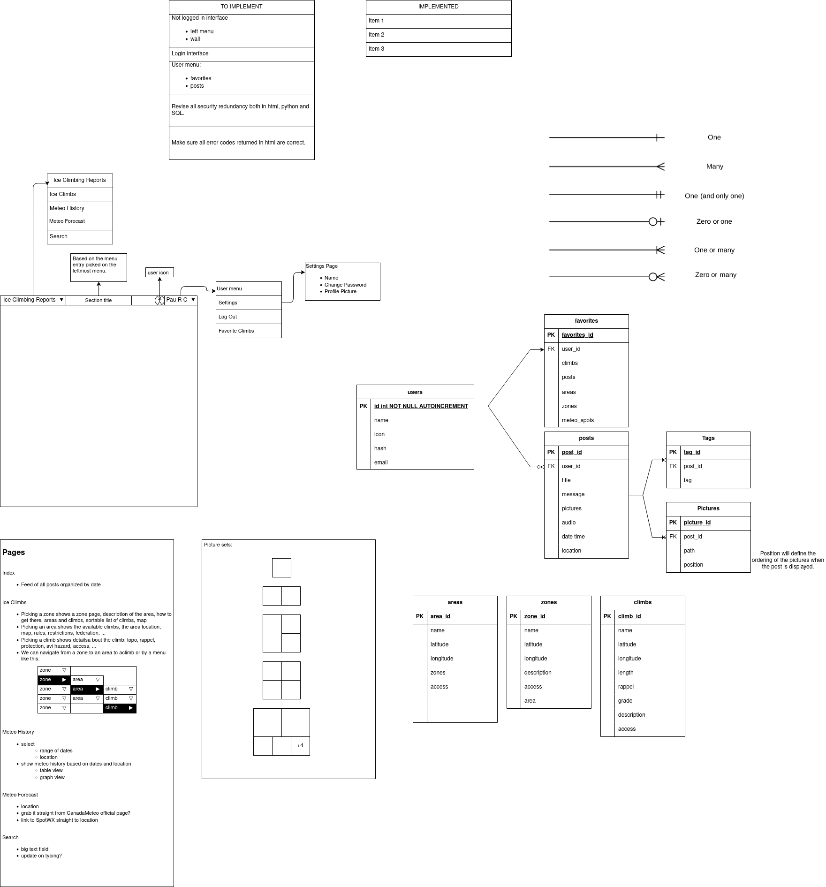

# ICE CLIMBING REPORTS
#### https://paurocher.pythonanywhere.com/
#### Video Demo (short: 2:48):  https://studio.youtube.com/video/HspJEeW5--A/edit
#### Video Demo (long: 4:32):  https://studio.youtube.com/video/aWDZArCJEIQ/edit


## Introduction
The "Ice Climbing Reports" project is a web application that allows users to communicate with each other about their ice climbing experiences. These experiences can be either weather reports, state of the ice in a particular climbing site, personal stories about a particular ice climbing experience, tips and tricks, car-pooling, etc ...

I wanted it to be like a kind of facebook wall: a never ending scroll of reports organized by date where posts can have both text and images.
These posts have the following fields:
 - author and date
 - images (optional)
 - title
 - body
 - location tags (optional)
 - other tags (optional)


Even though I have taken care of the visual aspects of the site (to a certain extent), my main focus was to make a database-heavy project. Databases has been one of the topics that has excited me the most during this course. 
Hence, I wanted to practice and learn more about them.
Flask and Jinja have opened a whole new world of possibilities for me. I have never been a big fan of html and css. But now, thanks to CS50's teachings about flask and jinja, I am feeling more open to it. 


## Motivations
- Consolidate CS50 knowledge.
  One of my favorite things I have learned during this course has been the database creation and management (even though I apparently failed at the Fiftyville project :D ).
  Also, Flask and Jinja have sparked a lot of interest in me!
- Centralize communication channels between ice climbers. 
  So far we use a lot FaceBook and Messenger but finding past messages gets often difficult.
- Reduce hazard.
  Communication is a key part in safety. Quickly sharing current conditions can make for more informed decision-making.
- Bring back the use of the first-nation toponomy.
  Increase importance, care and culture levels by making people more aware of their surroundings history and cultural heritage.


## Technical details

I have started this project with a diagram in which I have been noting down all ideas I wanted to implement, database organization and web-site design. This is a step I like doing before I start coding. Eventually I leave it on the side because the coding and the program has enough presence to make me comfortable enough to concentrate more on the technical aspects. Eventually the diagram and the final product might not have much in common but at least it helped me kickstart the project.  
The diagram:


### Description of the code
Here, I am going to describe the things I have been implementing in the project. I will present the information file by file but sometimes I will describe the general purpose of everything contain into a specific folder.

#### General decisions
- I opted for replacing error pages with flashed messages. I think it looks cleaner and offers a better user experience.


Here is a trimmed structure of the project:
```
webtest
├── ICR
*│     ├── __init__.py
*│     ├── .env
*│     ├── auth.py
*│     ├── blog.py
*│     ├── config.py
*│     ├── db.py
*│     ├── helpers
*│     │     ├── image_process.py
*│     │     ├── misc.py
*│     │     ├── post_edit.py
*│     │     └── sql_functions.py
*│     ├── misc
*│     │     ├── icons.kra
*│     │     └── xnview_scale_crop_preset_001.xbs
*│     ├── requirements.txt
*│     ├── schema.sql
│     ├── static
*│     │     ├── css
*│     │     │     └── main.css
*│     │     ├── icons
*│     │     │     ├── avatars
*│     │     │     │     ├── icon_01.PNG
*│     │     │     │     ├── ...
*│     │     │     ├── favicon.ico
*│     │     │     └── I_heart_validator.png
*│     │     └── images
*│     │         ├── 2025_03
*│     │         │     ├── pictures
*│     │         │     │     ├── 2025_03_05_06_29_38_0.jpg
*│     │         │     │     ├── ...
*│     │         │     └── thumbnails
*│     │         │         ├── 2025_03_05_06_29_38_0_tmb.png
*│     │         │         ├── ...
*│     │         └── 2025_04
*│     │             ├── pictures
*│     │             │     ├── 2025_04_01_22_16_16_0.jpg
*│     │             │     ├── ...
*│     │             └── thumbnails
*│     │                 ├── 2025_04_01_22_16_16_0_tmb.png
*│     │                 ├── ...
*│     └── templates
*│         ├── auth
*│         │     ├── login.html
*│         │     ├── psswd_change.html
*│         │     └── register.html
*│         ├── base.html
*│         ├── blog
*│         │     ├── create.html
*│         │     ├── create_mobile.html
*│         │     ├── edit.html
*│         │     ├── full_screen_carousel.html
*│         │     └── index.html
*│         └── post_template.html
```

### webtest/ICR/__init__.py
This is where the application factory resides. When the module is loaded, the create_app function is triggered and returns the Flask application.
To start the web site, this module is loaded in the "paurocher_pythonanywhere_com_wsgi.py" file in "pythonanywhere" (https://www.pythonanywhere.com/user/PauRocher/files/var/www/paurocher_pythonanywhere_com_wsgi.py?edit)
- When run from pythonanywhere, the app is configured by loading the config.py file and the environment variables set by loading the .env file. This is something that I have a hard time to assimilate. I am still reading and learning about security concerns (SECRET_KEY) and config implications, when to use which cnfig in which situation ...
- The database creation terminal command is set up
- The blueprints are registered. Working with blueprint was a great way to separate more the different parts of the project and having it better organized.

### webtest/ICR/ .env, config.py
Where the environment variables are defined by either declaring them here or reading them on the config.cfg file.
I still do not fully understand why having different ENVIRONMENT or why a SECRET_KEY are needed.

### webtest/ICR/blog.py
This is the module that controls the behavior of the index of the site.
- Gets all posts and shows them in the index.html page
- Triggers the functions to create a new post or edit an existing one (only if the user is logged in).
- Launches the carousel page when an image is clicked

Thanks to the "blog" blueprint, the functions in this module can be called by the url for the blog page by applying the "@bp.route" decorator.

### webtest/ICR/auth.py
All functions dedicated to manage authentication:

**register**
- Gater the web page fields
- Check the password quality
- Check the DB for existing username
- Create new user in the DB

**login**
- Gather web page fields
- Check the DB for existing username
- Check password is correct

**load_logged_in_user**
This function serves to get the current user.
It works by getting the session user_id and set it to the g object. If no user is found then the g.user attribute is set to None.

**logout**
Logs the user out by clearing the session and redirecting to the index page. The user name not being in the session anymore will lock out the editing, creating or logging out functions.

**login_required**
If a user tries to something that needs authentication he gets redirected to the login page. This decorator is applied to the create and edit functions of the blog module.

**psswd_change**
Facilitates password change only if new password fits the requirements (check done in misc.new_password_quality): 
  - minimum 6 characters long
  - at least one special character
  - new password and confirmation must match
As with all pages I am using flash messages to give feedback to the user.


### webtest/ICR/db.py
Functions related to handle the connectio to the database.
First I am defining how sql dates should be converted to python objects by defining a converter which is just a lamda function.

**init_app**
Closes the connection to the DB if the flask app context is popped.
Adds the `init-db` cli command.

**init_db_command**
Adds the `init-db` cli command thanks to the click.command decorator.
This command initialises the DB, which means it is created (or overwritten if it is already there) with the execution of the SQL script in the schema.sql file.

**get_db**
ingests the DB in the g object.

**close_db**
Removes the DB from the g object and closes the connection to it.

### webtest/ICR/requirements.txt
List of required packages to run this app.

### webtest/ICR/schema.sql
SQL script to create the database. Alos fill it in with predefined values so the site starts off with some posts and users in it.

### webtest/ICR/helpers/image_process.py
All the image processing related functions live here.
This module gave me a bit of a headache because of the paths: when my web app was all done and tested it on pythonanywhere I realized that all paths needed to be absolute. So I had to refactor many functions and the database to make them read/write everything on absolute paths that would work on pythonanywhere.
The folder structure is based on the month and the year in which the image was uploaded. This allows for good organization of all images and mitigates the risk of image name conflicts.

When images are uploaded, if they comply with the requirements (have a valid file extension) they will:
  - get a name generated (based on the date)
  - generate the folder structure if needed
  - be saved to the appropriate directory at full size
  - be saved to the appropriate directory at thumbnail size

Having 2 image sizes allows for faster loading times of the index.html page because it only loads the thumbnail, smaller images. Then the carousel shows the full size images.
FOr speed and memory efficiency, I made the index.html page to load images only when needed. This means that images outside the screen boundaries are not loaded!!

I used the Pillow library to transform the images to appropriate dimensions to generate the thumbnails and the full size pictures.

### webtest/ICR/helpers/misc.py
Misc utility functions:

**new_password_quality**
Check that a password complies with the requirements:
  - minimum 6 characters long
  - at least one special character
  - new password and confirmation must match

**validate_file_type**
Check that a file has a valid file extension. File extensions are passed as an argument to this function, making its functionality more open.

**is_mobile**
Determine if the device accessing the site is mobile phone or not.

### webtest/ICR/helpers/post_edit.py
This module felt like the most difficult to write. It is where all functions related to post editing and deleting are gathered. On each edit, the DB needed to be consulted to add or remove new items based on the user edit of the post.
When items (tags, pictures, ...) were deleted, I did not want to just unlink the relationship from the post to that item in the DB. I also wanted to check if any other post was referring to that item and if not, delete it from disk (in the case of images and thumbnails) and from its DB table, to make sure the disk space was not wasted.

It has two very distinct parts: delete and update.

Some parts of these functions should have gone into the sql?functions module, but were so short and specifi that I left them here, live inside their functions ... But looking back at it now, I believe the sql?functions module is a better place for them even if they are short.

After the DB is updated, the user is redirected to the index page where the new updated content is shown.


### webtest/ICR/helpers/sql_functions.py
This is where the functions for getting and inserting information in the DB live.

When getting a post, I create a dict out of it with all the related information, so I can easily process it anywhere in the app.
I am doing the opposite for inserting a post: I am starting off of a dictionary and parse it to insert into the appropriate tables.


### webtest/ICR/misc
Here I am storing the krita project I created to create icons for the users. This was an idea I had where each user could choose their avatar from a list of icons or upload their own. I did not implement this. I thought the project was big enough like it is :)
Also, a XnView macro I used to turn many pictures I had into pictues and thumbnails I used to insert into the posts that are autogenerated when the DB is reset.


### webtest/ICR/static
This folder contains all immutable files that are needed to run the site.

The CSS file is where I am setting>
  - the look of the brand name
  - carouse related styles:
    - scaling and aspect ratio related styles for the displayed images
    - look of the next and previous buttons

The icons folder is where I saved the default icons users would be able to use when this feature is actually enabled. As I said above, I abandoned this idea due to the already big complexity of this project.

The images folder is where all uploaded images are saved. The internal folder structure is created and managed programatically in the image_process.py module:
    - checks are run for file format validity
    - images are scaled to maximum allowed picture size
    - thumbnails are generated


### webtest/ICR/templates
The templates folder contains all the html templates for the site. They are organized so that the blueprints can access them easily thanks to the folder structure.

All pages inherit from the base.html template, which contains:
  - the navigation bar (is different for logged in and logged-out users)
  - the footer
  - loads the css file
  - sets the bindings to bootstrap

#### webtest/ICR/templates/auth
The auth folder contains the templates for the login, register and password change pages.

**login.html**
The login page calls the auth.login view function when the submit button is pressed.
It is a very simple page that has a form for the user to enter their username and password and get logged in if the username exists and the password is correct.

**psswd_change.html**
The password change page calls the auth.psswd_change view function when the submit button is pressed.
Like the previous one, this is a very simple page that inherits from the base.html template and has a form for the user to enter their old, new password and a confirmation for the new password.

**register.html**
The register page calls the auth.register view function when the submit button is pressed.
It has a form for a new user to enter their username and password and get registered if the username is new and the pasword complies with the requirements.

#### webtest/ICR/templates/blog
The blog folder contains the templates for the create, create_mobile, edit, full_screen_carousel and index pages.
In these pages, the contents of the blog are displayed, created, edited, and deleted.

**create.html**
This page only is accessible for logged in users. It differs wheteher it is opened on a phone or a computer. It calls the blog.create view function when the submit button is pressed.
The form consists of:
  - the title
  - the message
  - picture upload or take a picture with the camera if the user is using a phone
  - the first nation location tags
  - the non-first nation location tags
  - the tags
  - the submit button

The title and the message are free text fields: the user can put in any text.
Any amount of pictures can be attached to the post. They will get checked, processed, saved, ingested into the DB and associated to the post.
The same will happen if the user takes a picture. I could not find a way for the user to take multiple pictures at once using only html.
The first nation location, the non-first nation location tags and the tags fields are lists of comma separated tags that can be entered by the user.
When the form is submitted it makes sure that a tag is new before ingesting it. Otherwise, it will only associate the existing tag(s) in the database to this post. This is a measure to save hard disk drive usage.

**edit.html**
This page only is accessible for logged-in users. It differs whether it is opened on a phone or a computer. It calls the blog.edit view function when the submit button is pressed.
I implemented frames around each section of the form to differentiate it from the create page. This css code lives in the edit.html page. It uses a blck I defined in the base.html page where we can extend the head defined in the base.html page.

The form consists of:
  - the title
  - the message
  - list of existing pictures that the user can 'tick' to delete with the use of a sliding checkbox
  - upload new pictures
  - take an extra picture with the mobile phone camera if the user is using a phone
  - the first nation location tags
  - the non-first nation location tags
  - the tags
  - the submit, Cancel and Delete buttons

The whole post can be deleted by pressing the Delete button.
Hitting Cancel, none of the post elements is modified.
Pressing the Submit button will update any of the modified elements:
  - title
  - message
  - pictures will be deleted if any was 'ticked'
  - pictures will be uploaded if any was added
  - first nation and non-first nationlocation tags will be added or removed
  - tags will be added or removed

**full_screen_carousel.html**
This page can be accessed by anyone, no need to be logged-in. It is opened when any thumbnail in the index page is clicked.
It recieves a list of the images of the post belonging to the clicked thumbnail. These images are displayed in a crousel in which I modified the style for the 'next' and previous' buttons and made sure the images are displayed properly independently of their aspect ratio.

**index.html**
This is the landing page, the most seen by anyone. It is funny to think how simple its html and pyhon are compared to the edit page for example!
I made sure the images are loaded only when needed to increase loading speed of the page.
It displays all available posts in the database. They are organized by date. I made sure that if any native location tag exists for a post, it is displayed first. I would love that outdoorsy people get a closer relationship with the places they visit. Knowing the original native name of places is important to get a sense of the history and increase the respect for the land and its original inhabitants.

A project for the future is to be able to filter the posts. Location tags and tags could be buttons that trigger filters, for example.


## Documentation Sources
https://docs.python.org
https://docs.python.org/3/library/sqlite3.html
I had to learn to manage the database through python. The official documentation is very good.

https://flask.palletsprojects.com/en/stable/tutorial/
Amazing tutorial that takes you deeper to dynamic web apps with flask than what we did on CS50. I took it as a base for this project. Many concepts were new to me. But searching documentation about them online I was able to learn so much more. Things like
 - creating SQL scripts, so I can easily initialize the database any time needed
 - defining command line commands with the click package
 - using flask blueprints (something we did not learn in CS50)

https://blog.miguelgrinberg.com/post/the-flask-mega-tutorial-part-i-hello-world
 - Together with the tutorial mentioned above, this one has been a real source of inspiration and a great place to find answers to my many, many questions.

https://flask.palletsprojects.com/en/stable/api/#
https://jinja.palletsprojects.com/en/stable/api/
https://werkzeug.palletsprojects.com/en/stable/
https://pillow.readthedocs.io
 - the manual reference for these various apis

https://getbootstrap.com/docs/5.3/getting-started/introduction/
https://www.sitepoint.com/bootstrap-grid-mastering-flexbox/
https://www.sitepoint.com/understanding-and-using-rem-units-in-css/
 - I got at bit more at ease with html, css and bootstrap. The bootstrap documentation feels less cryptic now. Also thanks to the many tutorials and guides I found online, I was able to unblock many of the design choices I decided to make.

https://www.stackoverflow.com
https://www.w3schools.com/
 - For all and any questions about html, jinja, css, python, bootstrap, flask, ...

www.rogers.com
 - Playing with my modem to open ports was a total failure. After breking my internet connection I realized I did not have my username and password to reconfigure the modem. The gentle people at Rogers helped me set it up back again. And this time I made sure to note down the configuration, username and password!! Now I can test my site in my computers and phones!! 

https://ttl255.com/jinja2-tutorial-part-1-introduction-and-variable-substitution/
 - Great and detailed Jinja tutorials.

https://python-adv-web-apps.readthedocs.io/en/latest/index.html
 - Helped me greatly in different aspects: from flask to sql abd jinja.

https://flask.palletsprojects.com/en/stable/patterns/fileuploads/
https://blog.miguelgrinberg.com/post/handling-file-uploads-with-flask
 - File uploads was totally new to me. Thanks to these 2 links I got all the necessary information to do it.


### Tools used
#### Git
I do not feel very at ease with git still. I have mostly worked off-line, mainly on a branch and not pushing to it very often.
I have used it professionally for many years, but always like an alchemist 
working on the philosopher stone but fearing a big explosion would fry my brain.
I know that with practice, I will lose this fear a bit I will feel much more comfortable with it.
Using lazygit has helped me a lot in gaining confidence in the common git operations.

#### Lazygit
This awesome tool has made me work faster and gain confidence with git. I will allways be grateful!! Having always used git manually in a terminal, I know now what goes on behind the scenes when using lazygit, so I am not afraid to use it now.
https://github.com/jesseduffield/lazygit


#### https://validator.w3.org
This site allowed me to validate the generated html in my pages. Seeing al the errors in early stages was eye-opening! Great tool!!

#### icecream
This little python library allowed me to have a nice and clean debug output in the terminal with minimal effort.

#### windsurf / cascade
I used this pycharm plugin mainly to populate some docstrings at the very end of the project.
I like writing my code and clarify my doubts or learn by consulting pages like stackoverflow, w3schools, flask, jinja, etc. Most of the time, autocompletion annoys me a lot. Also proposed code when chatting to the AI needs a lot of babysitting because it is often either wrong or accounts for way too many cases that are not relevant to my needs.

### pythonanywhere
I never put a web site on the internet, let alone a web app! pythonanywhere made it very easy although I had to make a few changes to the code to get it to work. For example, I had to rename my app to "app" (it was called "IRC" before), I had to configure the WSGI file they provide, clone my git repo to the pythonanywhere server using one of their terminals, and that was pretty much it.
Then I hit many problems related to paths not being absolute which I fixed with a few changes in my code to make sure all paths generated in the app were absolute.
Other than the paths hiccup, it all went really well.

### PyCharm
I wrote all my code using PyCharm. I like its interface, after a few years I am getting more and more productive with it thanks to the assiminlation of keyboard shortcuts. I like that the terminal is integrated in the IDE. Also, the syntax highligting and code inspection is really useful.

## Conclusion
I must admit that I aimed for a too big of a project. That was not my intention. I really wanted to exploit the acquired knowledge about databases and thought that this web site would not require so much work. But after brainstorming and designing the project, and after I started coding it two things happened: I got really excited, and I realized that this was growing more and more. The excitement of seeing everything come together was obscuring the reality and I went along implementing all I had in mind.
With that said, I have learnt a lot about making web applications and am very satisfied with the result. Of course many things are missing (like avatars, filters, clickable tags, ...) but I am happy I found the brake pedal and dcidd to pospone those features for now.

I am very grateful to the cs50 team. Your pedagogical level is extremely high. It shows you all are passionate about teaching, that you put effort in making the sessions interesting, challenging, fun.

Thank you very much for the revision of my project.

This is not a goodbye, because I know I am going to enroll on the databases and python courses soon!! <3